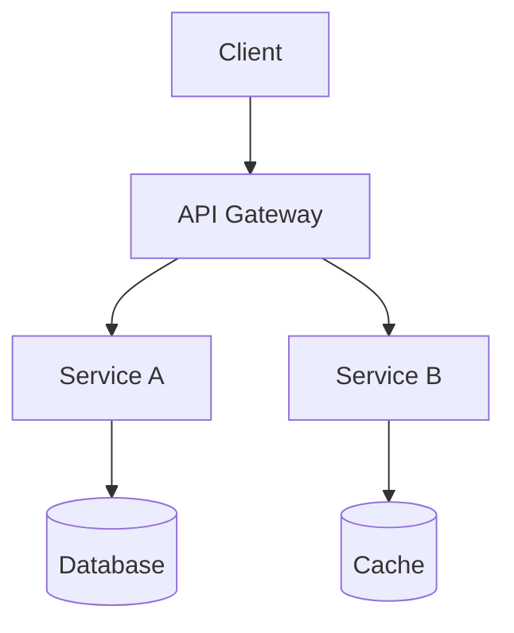
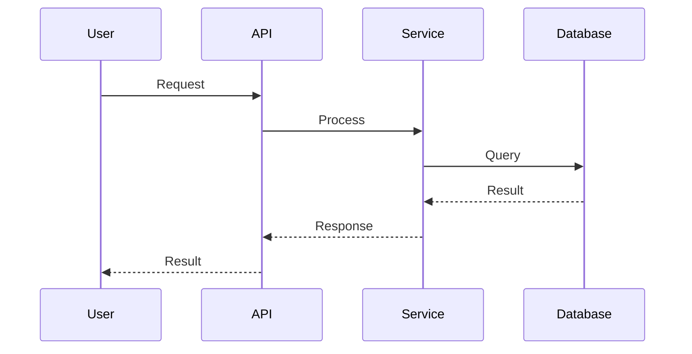

# PES Template (Product Engineering Spec)

## Feature Name
[Name — must match the PRD]

## Architecture Overview


## Component Design

### [Component Name]
- **Responsibility:** [single responsibility description]
- **Technology:** [chosen technology]
- **Rationale:** [why this technology over alternatives]
- **Interfaces:** [API contracts this component exposes]

## Data Flow


## API Contract (OpenAPI)
```yaml
paths:
  /api/v1/resource:
    post:
      summary: [description]
      requestBody:
        content:
          application/json:
            schema:
              type: object
              properties:
                field: { type: string }
      responses:
        '200':
          description: Success
        '400':
          description: Validation error
```

## Database Schema
[ERD or table definitions]

## Architecture Decision Records

| Decision | Options Considered | Chosen | Rationale | Revisit When |
|----------|-------------------|--------|-----------|--------------|
| [topic]  | [A, B, C]         | [B]    | [why]     | [condition]  |

## Security Considerations
- **Authentication:** [method]
- **Authorization:** [model]
- **Data encryption:** [at rest, in transit]

## Technical Risks
| Risk | Probability | Impact | Mitigation |
|------|-------------|--------|------------|
| [risk] | [H/M/L]  | [H/M/L] | [strategy] |
